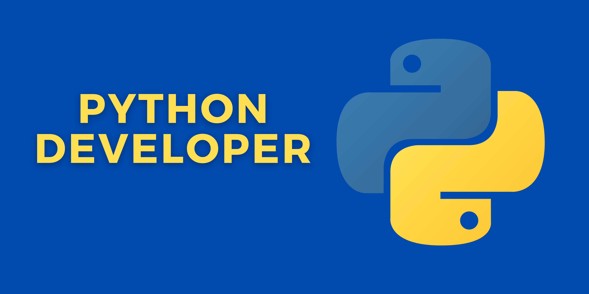

<h1 align="center">
    
</h1>

<h4 align="center">
    🚧 Formação Python Developer 🚀 em construção... 🚧
</h4>

## 💻 Sobre o bootcamp

🐍 Formação Python Developer - Com 64hrs de curso, o bootcamp da Digital Innovation One traz os principais assuntos sobre a linguagem.
A participação neste bootcamp se faz pela utilidade que o Python tem nas tarefas cotidianas.

Os módulos abordados no curso:
- Fundamentos de Python;
- Aprendendo Estruturas de Dados com Python;
- Programação Orientada a Objetos com Python;
- Integração com Python e Frameworks;
- Tratando Dados com Python;  
- Praticando Desenvolvimento Web com Python.
